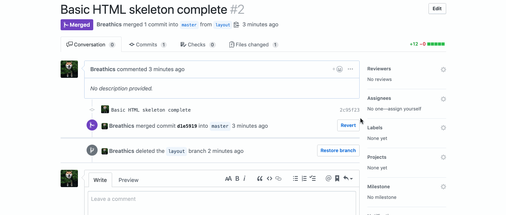

# Guessing Game

Before starting on this exercise, you will need to **fork** and then **clone** this repository into your `lfz` folder on your current development environment.

1. Fork this repository from LearningFuze
    - Click on the <kbd>**Fork**</kbd> button at the top right of the page.
    - Select your Github user name to complete the fork

2. Clone this repository to your development environment
    - In your terminal, navigate to the location of your `lfz` folder
    - `cd ~/lfz` or `cd ~/Desktop/lfz`
    - `git clone https://github.com/[Your User Name]/guess.git`

3. Navigate into the `guess` directory
    - `cd guess`
    - You are now ready to get started!
    - If you are not in the proper directory, navigate to the `lfz` folder, if you're not sure how, contact an instructor.

## Getting Started

After navigating into this repository, you will want to start by creating a new branch off of the `master` branch to contain the code required for the next feature of this exercise.

Each challenge will represent each of the total three branches that you will be creating throughout this exercise.

### Before each challenge

- Make sure that the current branch says `master`.
  - Check that with the `git status` command.
    1. If you are on `master`:
       - `git pull origin master`, will get your most up to date changes and update this branch.
       - `git checkout -b FEATURE_NAME_HERE`, will create a new branch based on the name provided to represent this next feature.
    2. If not, `git checkout master`, will take you back to the default branch.
       - Go back to step 1.
    3. If you're not sure how, contact an instructor.
- **Example**
  - `git status`
  - `git checkout master`
  - `git pull origin master`
  - `git checkout -b skeleton`

You are now ready to start on the first challenge!

#### Challenge 1 - HTML Skeleton (*skeleton*)
- Create an `index.html` file.
  - Make an `html` skeleton.
  - Make sure to use a `<title>` for an appropriate title.
- Add an `<input>`.
  - This element will take the user's guess.
  - Give it an id of `guess_input`.
- Add a `
`.
  - This element will display text based on the user's guess.
  - Give it an id of `response_div`.
- Add a `<button>`.
  - This element will submit the user's guess to the game.
  
#### Challenge 2 - Defining random number (*getRandomNum*)
- Create a `main.js` file and add a `<script>` to the top of the `index.html` that links to this JS file.
- Create a variable called, `the_number`.
- Create a function that will be used to generate a random number between 1 and 10.
  - This function will be used to assign a random number to the variable named `the_number`.
  
#### Challenge 3 - Feedback for user input (*handlingEvents*)
- Inside of your `main.js` file.
- Create a function that will be used to retrieve the number entered in the `<input>` and then change the text on the `response_div` appropriate to the following:
  - If `the_guess` is higher than `the_number`, it changes the text of `#response_div` to **"Too High!"**
  - If `the_guess` is lower than `the_number`, it changes the text of `#response_div` to **"Too Low!"**
  - If `the_guess` is the same as `the_number`, it changes the text of `#response_div` to **"You guessed it!"**
- Apply a click event handler to the `<button>` to call the function created to handle our guess.

### After each challenge

- When your feature implementation is complete, you will want to save and submit your work to the branch that you have created.
  - Use `git status` to check that you are on the correct branch that represents your feature.
  - You will want to **add**, **commit**, and **push** the code that you have written to the appropriate Github repository.
    1. `git add .`
    2. `git commit -m "Description of the feature that you have implemented"`
       - e.g. `git commit -m "Added simple HTML skeleton"`
    3. `git push origin FEATURE_NAME_HERE`
       - e.g. `git push origin skeleton`

- Finally, you will want to create a pull request. This will merge the code from your newly **completed** feature branch into your `master` branch.

  1. Navigate to <kbd>New Pull Request</kbd>:
  
  2. Compare changes to merge: 
  
  3. Create a new pull request:
  
  4. Merge pull request:
  
  5. Update master with the new changes:
  
  6. Go back to **Before each challenge**, if you're still working through the exercise.